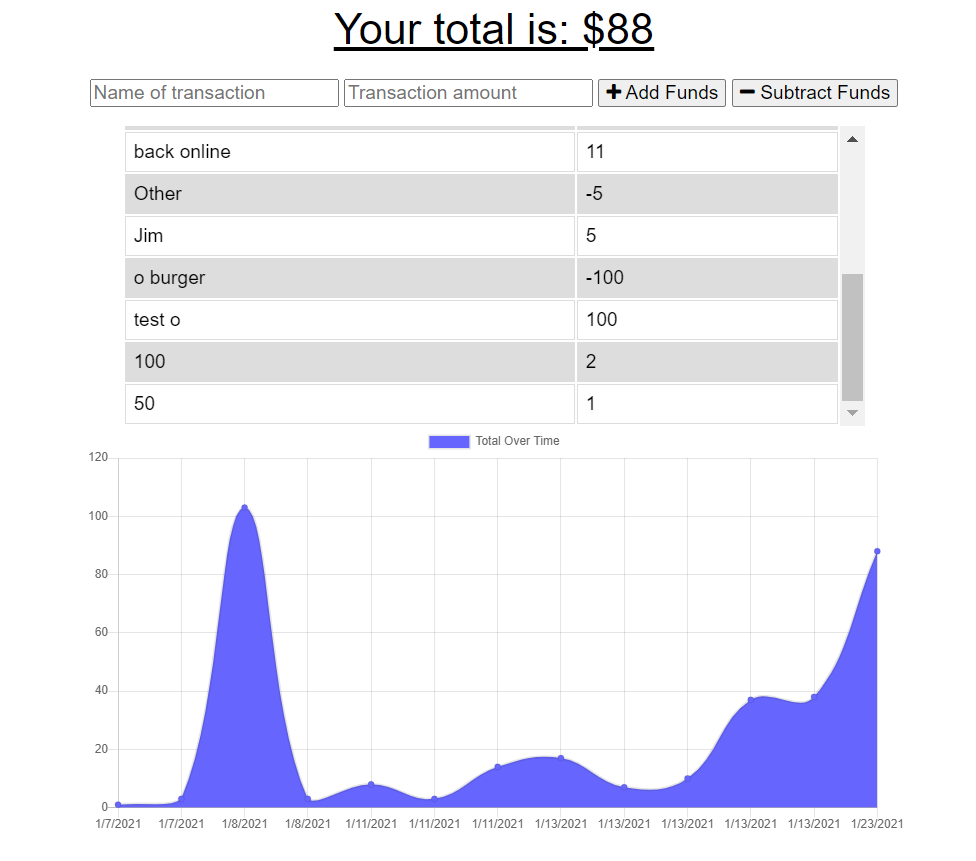

# Budget Tracker
  
  ## Table of Contents
  * [Description](#Description)
  * [Technologies](#Technologies)
  * [Usage](#Usage)
  * [License](#License)
  * [Questions](#Questions)
  ## Description
  The Budget Tracker is a progressive web app deployed on Heroku that allows the suer to make updates to their budget on-line and off-line. When the budget item is entered into the form the Budget Tracker updates a Mongo database. When the app is off-line, items entered in the form are cached. When the user goes on-line, the cached items are reutnred to the mongo database and stored. The app is deployed to [heroku](https://fierce-cove-80961.herokuapp.com/).
  
  ## Technologies
  * JavaScript
  * NPM Modules
  * Visual Studio Code
  * Node.js
  * Package.json
  * Mongodb
  * Express
  * Mongoose
  * Service Workers
  ## Usage Information
  Enter a budget item in the form either on-line or off-line. The budget item will be stored and charted for further use.
  ## License
  Copyright (c) Microsoft Corporation. All rights reserved.
  
  Licensed under the MIT license.
  ## Questions
  If you have any further questions, please contact me at jwheele1@gmail.com.
  My GitHub profile is [Github Repo](https://github.com/jrtwheeler).
